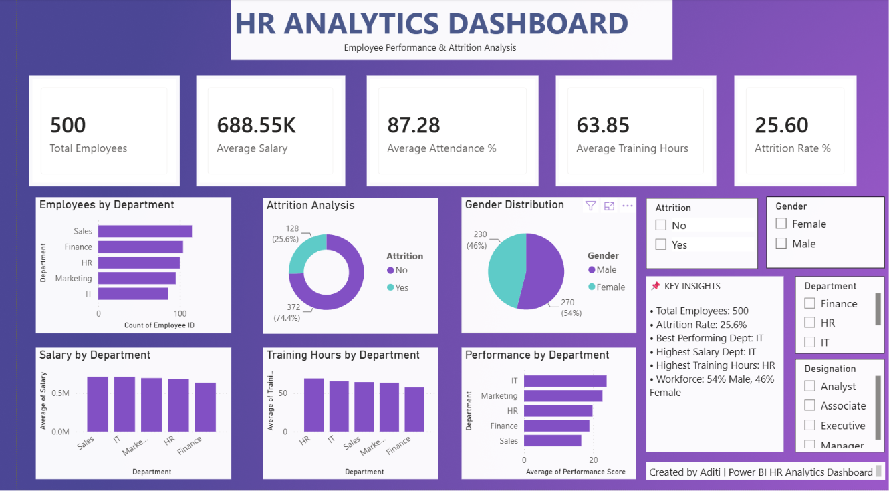

# HR Analytics Dashboard - Power BI

## Project Overview
This Power BI dashboard provides insights into employee performance, salary trends, attendance, training hours, and attrition rates.

## Key Insights
- Total Employees
- Average Salary
- Employee Attrition Rate
- Department-wise Performance
- Attendance Analysis
- Training Hours Tracking

## Tools Used
- Power BI
- DAX
- Power Query
- Excel

## Dashboard Preview

## Features
- Interactive Filters & Slicers
- KPI Cards
- Trend Analysis
- Department Comparison
- Employee Performance Tracking

## Business Impact
This dashboard helps HR teams make data-driven decisions regarding workforce planning, employee retention, and performance management.

## Author
Aditi Pandey
